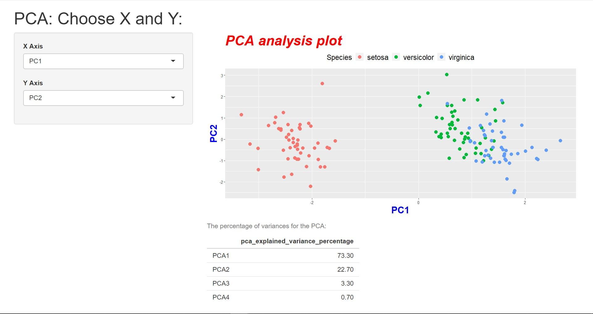

# PCA analysis
This is a simple PCA analysis visualization on the iris dataset via Shiny. 
## Prerequitites
1. ggplot2
2. shiny app
## Function
You can compare between different components. 
Output: 