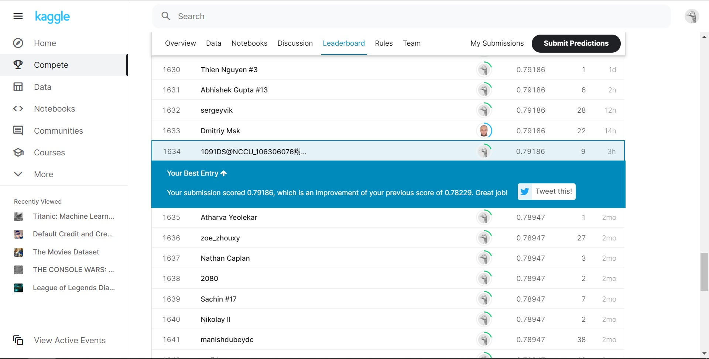

# Titanic - Machine Learning from Disaster
👇Please click the link below to know the details of the data.\
https://www.kaggle.com/c/titanic/overview \
Uses n-fold cross-vaildation to select the best model.\
Data preprocessing: Uses ```lm``` model to predict the Age column if "Age" is empty.\
Model and Parameters: Uses ```rpart``` model for training the prediction model. Only changes 'maxdepth' and 'minbucket' parameters to find the best model.\
'bestperformance.csv' is the accuracy for different tests. 'bestpredict.csv' is the format for submitting to the competition.\
This prediction model will get you around top 8% for the Kaggle competition. 
